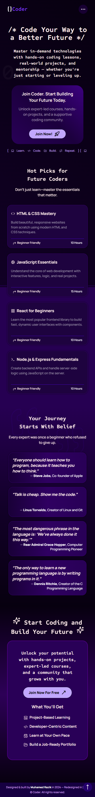
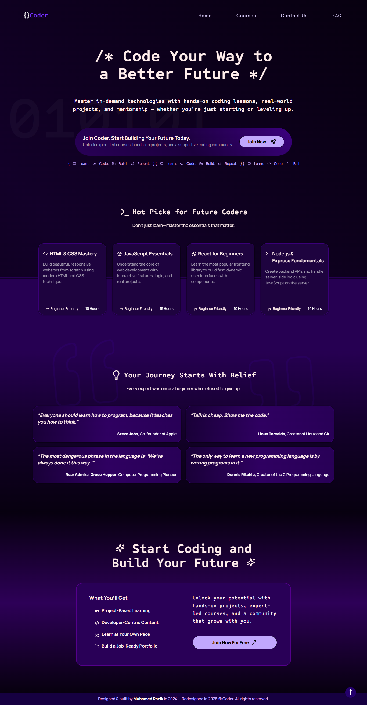
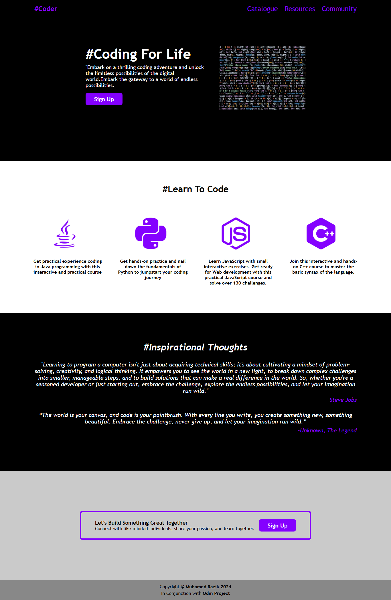

# { }Coder

An interactive, scroll-based learning website created as part of my web development journey.  
Initially a basic static page, this project was **redesigned in 2025** with a modern UI, mobile-first responsiveness, and scroll-triggered interactions to provide an immersive coding education experience.

---

## 📅 Project Timeline

- **First Created**: March 2024  
- **Redesigned**: June 26, 2025  
- 🎨 Landing page revamp inspired by modern developer platforms like Scrimba and Frontend Mentor

---

## 🔗 Live Site

- 🌐 [Live Website](https://muhamedrazik-2003.github.io/Coder-landing/)
- 📂 [GitHub Repository](https://github.com/muhamedrazik-2003/Coder-landing)

---

## 📖 Project Overview

This project started as a simple educational website built with plain HTML and CSS.  
After a year of learning and skill-building, it was redesigned with scroll interactions, responsive layout, and improved content structure.

### ✅ Highlights of the Redesign

- Modern UI with smooth scroll-based animations
- Responsive design for both desktop and mobile
- Clean visual hierarchy with accessible typography
- Scroll-snap sections for fluid content transitions
- Developer-centric language and motivational content

---

## 🛠️ Built With

- HTML5  
- CSS3 (Custom Properties, Animations, Scroll-Snap)  
- JavaScript (Vanilla)  

---

## 🧠 Key Concepts Learned

- Structuring responsive multi-section landing pages
- Using `animation-timeline: view()` for scroll interactions
- Designing with semantic HTML and accessibility in mind
- Creating engaging user experiences through layout and motion
- Mobile-first design practices

---

## 📸 Screenshots

### 📱 Mobile View (2025)

### 💻 New Landing Page (2025)

### 🕰️ Old Landing Page (2024)

---

## 🚀 Future Improvements

- Add light/dark theme toggle  
- Use `IntersectionObserver` for advanced animations  
- Create login & course progress tracking using localStorage  
- Migrate to a framework like React for component reusability  
- Add interactive course previews or video demos

---

## 👨‍💻 Author

**Muhamed Razik**  
Created in 2024 • Redesigned in 2025  
Inspired by [The Odin Project](https://www.theodinproject.com/) and modern dev learning platforms

